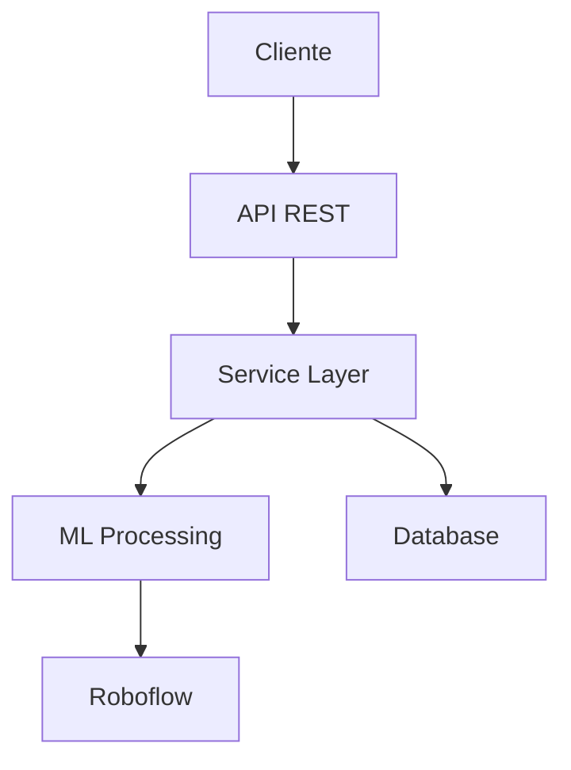

# OdontoAPP - Apresentação Final
> Sistema de Diagnóstico Odontológico com Machine Learning

## 🎯 Objetivo do Projeto

Desenvolver um sistema inteligente para diagnóstico odontológico precoce utilizando:
- Machine Learning
- Reconhecimento de Imagem
- Análise de Sintomas

## 🏗️ Arquitetura do Sistema

## 💻 Tecnologias Utilizadas

- **Backend**: ASP.NET Core 6.0
- **Machine Learning**: 
  - Roboflow
  - TensorFlow/Keras
- **Database**: Entity Framework Core
- **Tools**: Git, Visual Studio 2022

## ✨ Principais Funcionalidades

1. **Análise de Imagens**
   - Upload de imagens
   - Processamento ML
   - Diagnóstico preliminar

2. **Gestão de Pacientes**
   - CRUD completo
   - Histórico de diagnósticos
   - Acompanhamento

3. **Integração ML**
   - Roboflow API
   - Processamento assíncrono
   - Cache de resultados

## 📈 Evolução do Projeto

### Sprint 1
- Estrutura básica
- Modelo de dados
- API REST inicial

### Sprint 4 (Final)
- CRUD completo
- Integração ML
- Documentação
- Testes

## 🤔 Reflexão e Aprendizados

### O que funcionou bem
1. **Arquitetura**
   - Separação de responsabilidades
   - Modularidade
   - Escalabilidade

2. **Tecnologias**
   - Stack moderna
   - Integração eficiente
   - Performance

### Desafios
1. **Técnicos**
   - Processamento de imagens
   - Integração de sistemas
   - Performance com volume

2. **Processo**
   - Coordenação de equipe
   - Gestão de tempo
   - Documentação

## 🎓 Lições Aprendidas

1. **Técnicas**
   - Importância da arquitetura
   - Valor da modularidade
   - Necessidade de testes

2. **Processo**
   - Documentação contínua
   - Comunicação clara
   - Planejamento adequado

## 🚀 Planos Futuros

### Melhorias Técnicas
1. **Performance**
   - Otimização de processamento
   - Sistema de cache
   - Escalabilidade

2. **Funcionalidades**
   - Dashboard analítico
   - Sistema de notificações
   - App mobile

### Expansão
1. **Novas Features**
   - Mais tipos de análise
   - Integração com prontuários
   - Telemedicina

2. **Mercado**
   - Parcerias com clínicas
   - Versão enterprise
   - Marketplace

## 👥 Equipe

- **Jhemysson Moura Vieira** (RM552570)
  - Arquitetura e Backend

- **Robson Apparecido dos Santos** (RM552858)
  - ML e Integração

- **Talyta Botelho Perrotti** (RM553739)
  - Frontend e UX

## 📊 Resultados Alcançados

1. **Técnicos**
   - API REST completa
   - Integração ML funcional
   - Performance otimizada

2. **Negócio**
   - MVP completo
   - Base para expansão
   - Potencial mercado

## 🎉 Conclusão

O OdontoAPP demonstrou ser uma solução viável e inovadora para:
- Diagnóstico precoce
- Prevenção de problemas
- Acessibilidade à saúde bucal

### Próximos Passos
1. Expansão de funcionalidades
2. Melhorias de UX
3. Parcerias estratégicas

---

*Apresentação preparada para avaliação final do projeto - Março 2024*
